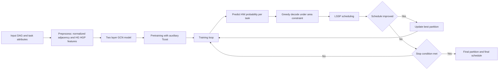
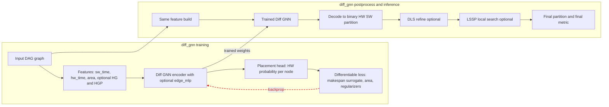
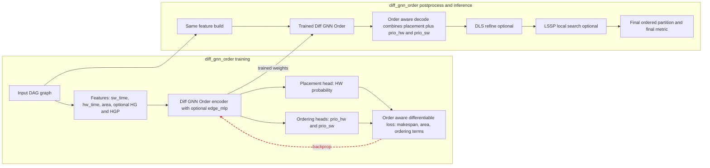

# Diff-GNN

This repository contains the hardware/software partitioning code for Diff-GNN and Diff-GNN-Order, together with classical baselines, MIP baselines, plotting utilities, and the batch scripts used to sweep datasets, seeds, and task-graph configurations.

`diff_gnn_order` is the paper version with ordering heads.  
`diff_gnn` is the ablated version without the ordering head.

## Repository Layout

- `Scripts/`: general-purpose runnable entry points that are safe to call from the repository root.
- `BatchExperiments/`: multi-dataset, multi-seed batch runners and plotting scripts.
- `configs/`: YAML experiment configurations.
- `inputs/`: DOT graphs, generated pickles, and topology-config caches.
- `meta_heuristic/`: Diff-GNN, Diff-GNN-Order, classical baselines, scheduling, and evaluation logic.
- `tools/`: config generation, plotting, graph synthesis, and visualization helpers.

## Installation

The codebase expects Python 3.10+ and works best in a dedicated virtual environment or Conda environment.

```bash
python -m venv .venv
source .venv/bin/activate
python -m pip install --upgrade pip
pip install numpy pandas networkx omegaconf pyyaml matplotlib seaborn pydot cvxpy pyswarms pypop7
pip install torch torchvision torchaudio
pip install torch-geometric
```

If you want MIP runs with the default SCIP-style configuration from the batch scripts, install a CVXPY backend you actually plan to use. A safe local fallback is HiGHS:

```bash
pip install highspy
```

Then run MIP jobs with:

```bash
SOLVER_TOOL=cvxpy-highs ./Scripts/run_all_mip_configs.sh
```

If you use a different solver backend, set `SOLVER_TOOL` accordingly.

For graph visualizations, install Graphviz on the system if it is not already available.

## Quick Checks

Check that the environment resolves the intended compute device:

```bash
./Scripts/check_gpu_usage.sh
```

Run a single local MIP solve:

```bash
./Scripts/run_mip_local.sh
```

Run the Figure 3 Diff-GNN demo:

```bash
./Scripts/run_fig3_diff_gnn_demo.sh
```

## Run Diff-GNN-Order

`diff_gnn_order` is the paper model with the ordering heads enabled.

Run only the paper version on one config:

```bash
HWSW_METHODS="diff_gnn_order" \
CONFIG_GLOB="configs/config_mkspan_default_gnn.yaml" \
./Scripts/run_diff_gnn_order.sh
```

Run it on a custom config set:

```bash
HWSW_METHODS="diff_gnn_order" \
CONFIG_GLOB="configs/config_mkspan_area_*_hw_*_seed_*.yaml" \
./Scripts/run_diff_gnn_order.sh
```

Outputs:

- CSV summary: `outputs/diff_gnn_order/makespan_opt-result-summary-soda-graphs-config.csv`
- Logs: `outputs/logs_diff_gnn_order/`

Note: `./Scripts/run_diff_gnn_order.sh` defaults to `HWSW_METHODS="diff_gnn,diff_gnn_order"`. Set `HWSW_METHODS="diff_gnn_order"` if you want only the paper model.

## Run Diff-GNN

`diff_gnn` is the version without the ordering head.

Run only `diff_gnn` on one config:

```bash
CONFIG_GLOB="configs/config_mkspan_default_gnn.yaml" \
./Scripts/run_diff_gnn.sh
```

Run it on the full config grid:

```bash
CONFIG_GLOB="configs/config_mkspan_area_*_hw_*_seed_*.yaml" \
./Scripts/run_diff_gnn.sh
```

Outputs:

- CSV summary: `outputs/diff_gnn_only/makespan_opt-result-summary-soda-graphs-config.csv`
- Logs: `outputs/logs_diff_gnn_only/`

## Run Both Diff-GNN Variants

To compare the no-ordering and ordering versions on the same config set:

```bash
CONFIG_GLOB="configs/config_mkspan_area_*_hw_*_seed_*.yaml" \
./Scripts/run_diff_gnn_order.sh
```

That script will run both `diff_gnn` and `diff_gnn_order` unless you override `HWSW_METHODS`.

## Run All Baselines

The differentiable and classical heuristics can be launched together with `Scripts/run_all_gnn_configs.sh`.

Recommended baseline set:

- `random`
- `greedy`
- `gcps`
- `gl25`
- `esa`
- `pso`
- `dbpso`
- `clpso`
- `ccpso`
- `shade`
- `jade`
- `diff_gnn`
- `diff_gnn_order`

Run that set on a single config:

```bash
HWSW_METHODS="random,greedy,gcps,gl25,esa,pso,dbpso,clpso,ccpso,shade,jade,diff_gnn,diff_gnn_order" \
CONFIG_GLOB="configs/config_mkspan_default_gnn.yaml" \
./Scripts/run_all_gnn_configs.sh
```

Run that set across the full configuration grid:

```bash
HWSW_METHODS="random,greedy,gcps,gl25,esa,pso,dbpso,clpso,ccpso,shade,jade,diff_gnn,diff_gnn_order" \
CONFIG_GLOB="configs/config_mkspan_area_*_hw_*_seed_*.yaml" \
./Scripts/run_all_gnn_configs.sh
```

Run the MIP baseline on the same grid:

```bash
SOLVER_TOOL=cvxpy-highs \
CONFIG_GLOB="configs/config_mkspan_area_*_hw_*_seed_*.yaml" \
./Scripts/run_all_mip_configs.sh
```

`Scripts/run_all_gnn_configs.sh` writes aggregated CSV summaries and per-config logs.  
`Scripts/run_all_mip_configs.sh` writes aggregated CSV summaries, solver logs, and partition artifacts.

## Run All Configurations and Task Graphs

The batch scripts under `BatchExperiments/` generate config selections from cached manifests, run the requested methods, and merge outputs by dataset.

### Dataset Sweep at Area 0.5

This is the main multi-dataset batch path.

Run the full dataset suite with the paper model only:

```bash
METHODS_OVERRIDE="diff_gnn_order" \
DATASETS_OVERRIDE="mobile_net_tosa rez_net_tosa squeeze_net_tosa anomaly_detection_tosa image_classification_tosa keyword_spotting_tosa visual_wake_words_tosa paper_fig3_11node" \
SEEDS_OVERRIDE="42 43 44 45 46 47 48 49 50 51" \
./BatchExperiments/run_dataset_area05_10seed.sh
```

Run all major baselines plus MIP:

```bash
METHODS_OVERRIDE="mip diff_gnn_order gl25 gcps esa pso dbpso clpso ccpso shade jade random greedy" \
DATASETS_OVERRIDE="mobile_net_tosa rez_net_tosa squeeze_net_tosa anomaly_detection_tosa image_classification_tosa keyword_spotting_tosa visual_wake_words_tosa paper_fig3_11node" \
SEEDS_OVERRIDE="42 43 44 45 46 47 48 49 50 51" \
./BatchExperiments/run_dataset_area05_10seed.sh
```

Useful overrides:

- `HWSW_MAX_PARALLEL_CONFIGS`: number of per-config workers inside a batch group.
- `HWSW_PARALLEL_DATASET_METHODS=1`: run dataset/method groups in parallel.
- `MIP_SOLVER_TOOL`, `MIP_TIME_LIMIT_SEC`, `MIP_GAP`: MIP controls.

### SqueezeNet Area Sweep

Focused area sweep for `squeeze_net_tosa` across the standard area points:

```bash
METHODS_OVERRIDE="diff_gnn_order mip gl25 gcps esa pso dbpso clpso ccpso shade jade random greedy" \
SEEDS_OVERRIDE="42 43 44 45 46 47 48 49 50 51" \
AREAS_OVERRIDE="0.1 0.3 0.7 0.9" \
./BatchExperiments/run_squeezenet_area_sweep_10seed_test.sh
```

There is also a reusable runner in `Scripts/run_squeezenet_area_sweep_10seed.sh` if you want the same workflow outside the `BatchExperiments` naming convention.

### Large-Scale Synthetic Task Graphs

Large-scale sweeps generate missing synthetic graphs automatically and then run the selected methods:

```bash
METHODS_OVERRIDE="diff_gnn_order gl25 gcps esa pso dbpso clpso ccpso shade jade random greedy" \
GRAPH_SIZES_OVERRIDE="1000 10000" \
SEEDS_OVERRIDE="42 43 44 45 46" \
./BatchExperiments/run_large_scale_area05_10seed.sh
```

### Runtime Sweep

Runtime sweeps use the same manifest-selection machinery and bucket the classical baselines by workload size:

```bash
./BatchExperiments/run_runtime.sh small
./BatchExperiments/run_runtime.sh medium
./BatchExperiments/run_runtime.sh large
```

Use `RUN_REAL_MIP_RUNTIME=1` if you want the MIP runtime to be measured directly instead of using the placeholder behavior in the plotting path.

### Ablation Runs

The ablation batch runner sweeps `diff_gnn`, `diff_gnn_order`, and the ablated variants:

```bash
VARIANTS_OVERRIDE="diff_gnn diff_gnn_no_postprocess diff_gnn_no_refinement diff_gnn_order diff_gnn_order_no_postprocess diff_gnn_order_no_refinement" \
DATASETS_OVERRIDE="paper_fig3_11node squeeze_net_tosa" \
SEEDS_OVERRIDE="42" \
./BatchExperiments/run_ablation.sh
```

To collect summarized ablation statistics after the runs:

```bash
./BatchExperiments/run_ablation_stats.sh
```

## Plot Existing Batch Results

Plot scripts consume the existing batch output folders and selected-manifest CSVs.

Dataset-area plots:

```bash
./BatchExperiments/plot_dataset_area05_10seed.sh
```

SqueezeNet area sweep plots:

```bash
./BatchExperiments/plot_squeezenet_area_sweep_10seed.sh
```

Large-scale plots:

```bash
./BatchExperiments/plot_large_scale_area05_10seed.sh
```

Runtime plots:

```bash
./BatchExperiments/plot_runtime.sh
```

## Notes on Script Organization

- General runners now live under `Scripts/`.
- `BatchExperiments/` still contains the batch-oriented scripts exactly as the experiment folder.
- The Slurm helpers were renamed to generic names:
  - `BatchExperiments/run_mip_slurm_dataset.sh`
  - `BatchExperiments/run_mip_slurm_legacy.sh`
  - `BatchExperiments/run_mip_squeezenet_area_sweep_slurm.sh`
- Generated result artifacts and machine-specific absolute-path traces were intentionally removed from the publishable tree.

## Mermaid Diagrams

### GCPS Method



### DIFF-GNN Without Ordering Head



### DIFF-GNN-Order Paper Version


